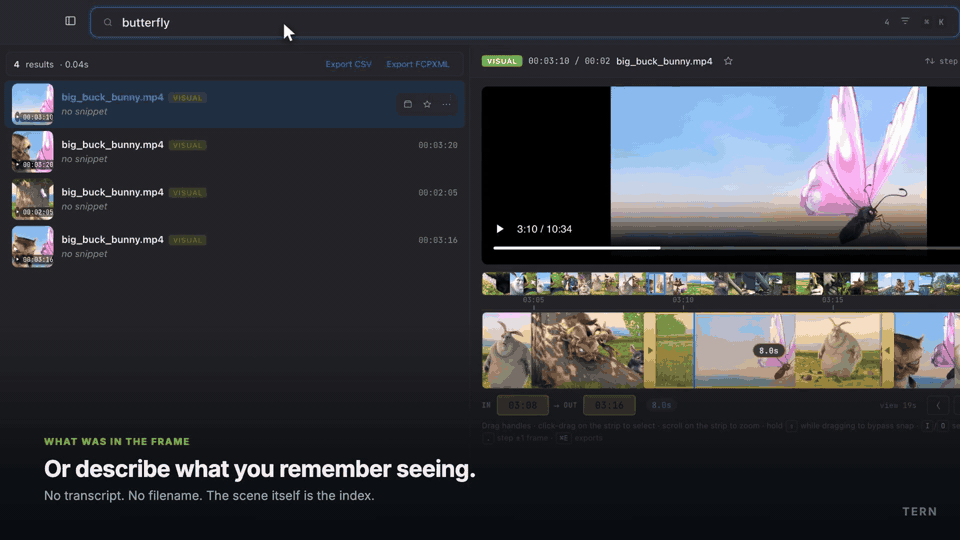
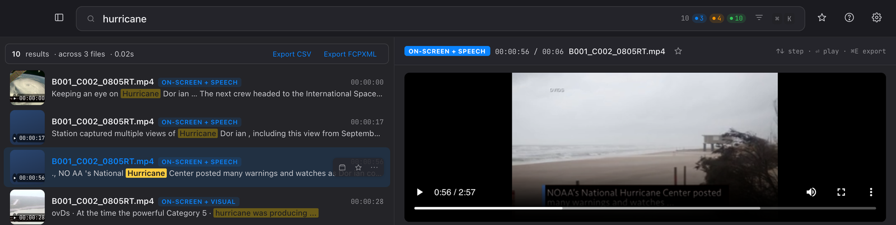
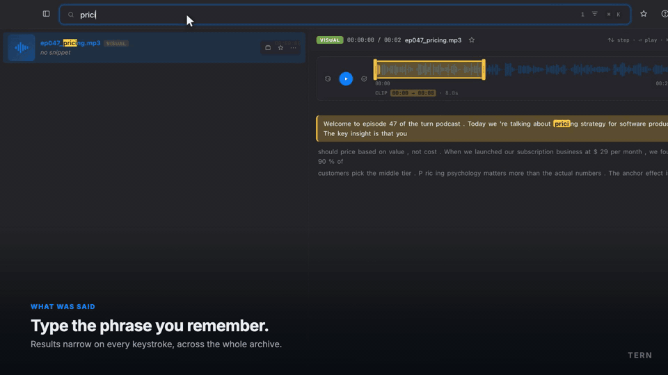
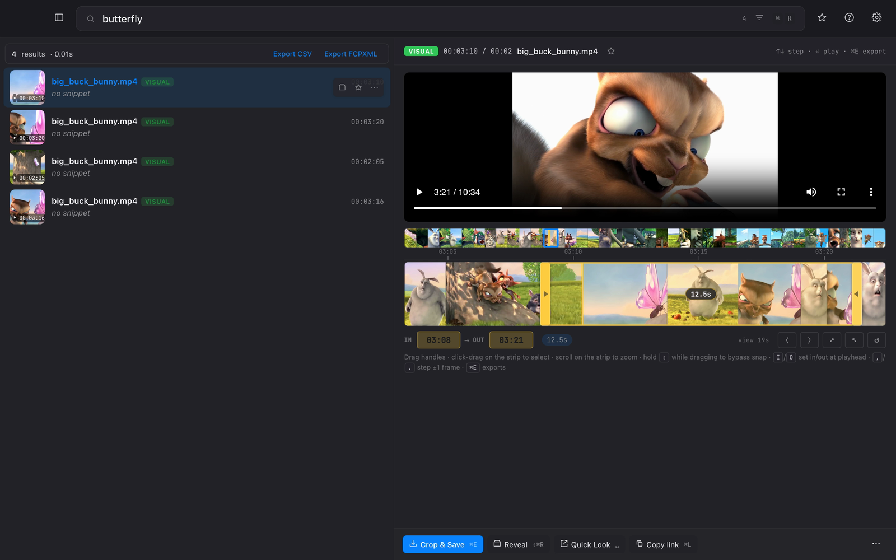
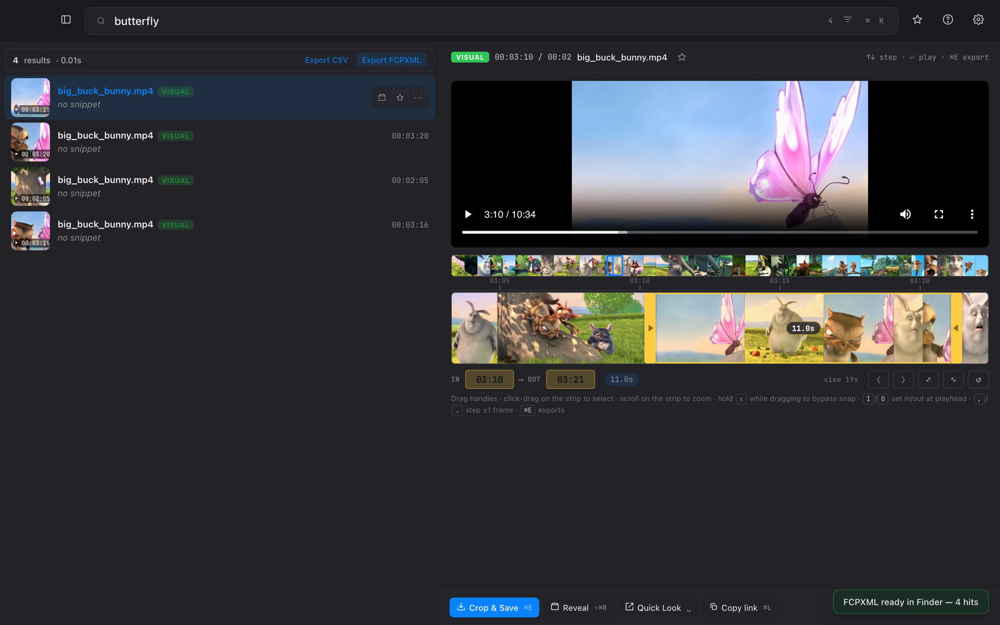
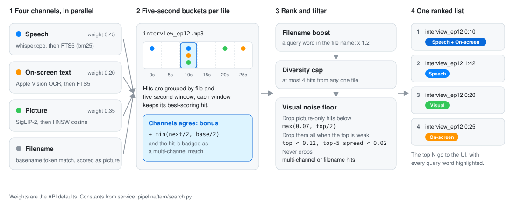
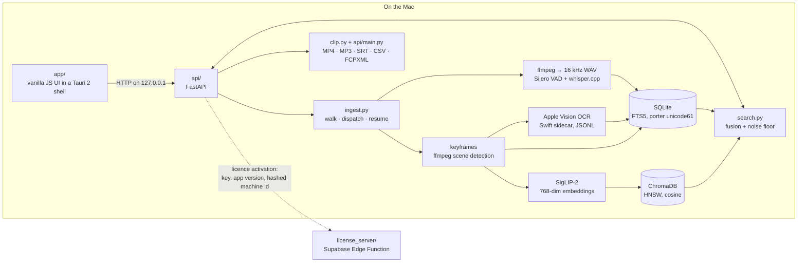

<p align="center">
  
</p>

<h1 align="center">Tern</h1>

<p align="center">
  Local search for podcast and video archives.<br>
  Find any moment by what was <b>said</b>, what was <b>on screen</b>, or what was <b>in the frame</b>, on-device, on Apple Silicon.
</p>

<p align="center">
  <a href="https://github.com/B0yko/tern/actions/workflows/ci.yml"></a>
  
  
  
  
</p>

<div align="center">
<table>
  <tr>
    <td align="center" width="200"><b>3 search channels</b><br><sub>speech · on-screen text · picture</sub></td>
    <td align="center" width="200"><b>On-device</b><br><sub>no media leaves the Mac</sub></td>
    <td align="center" width="200"><b>500 tests</b><br><sub>pipeline · API · licence rules</sub></td>
    <td align="center" width="200"><b>5 export formats</b><br><sub>MP4 · MP3 · SRT · CSV · FCPXML</sub></td>
  </tr>
</table>
</div>



*Visual search: no transcript and no filename to match, only the frame. The
clip is then trimmed in place, ready to export.*

## Contents

- [What it does](#what-it-does)
- [How it works](#how-it-works)
- [Engineering notes](#engineering-notes)
- [Running it from source](#running-it-from-source)
- [Tests](#tests)
- [Layout](#layout)
- [Status](#status)
- [License](#license)

## What it does

Point Tern at a folder of audio, video and photos. It indexes every file
three ways and answers a query from all three at once:

- **Speech.** whisper.cpp (Whisper Large v3 Turbo, Q5) transcribes every
  file, with word-level timestamps. Silero VAD marks the speech regions, and
  segments Whisper produces outside them are dropped, because Whisper
  hallucinates text on silence.
- **On-screen text.** Apple Vision reads every video keyframe and every
  image, through a small Swift sidecar.
- **The picture itself.** SigLIP-2 embeds every keyframe, so you can
  describe what you remember seeing rather than what the file was called.

Results from all three are fused into one ranked list. A moment that matches
on more than one channel ranks higher and is badged as a multi-channel hit.
A trim editor exports any hit as MP4 or MP3; SRT subtitles, CSV and an
FCPXML timeline for Final Cut Pro export from the result list.

Media and the index never leave the Mac: transcription, OCR and embedding
all run locally. The network is used to fetch the models on first use (the
Hugging Face library also revalidates its cached copy when it loads one),
to activate a licence, for the update check, and to open Apple Maps when
you click a photo's location.



*`hurricane` against NASA footage: the caption burned into the video and the
narration match the same moments, so the hits are badged On-screen + Speech.*



*Speech search narrowing as you type, across several episodes of a synthetic
demo podcast (the episodes are not included in this repository).*

<table>
  <tr>
    <td width="50%"></td>
    <td width="50%"></td>
  </tr>
  <tr>
    <td><em>The trim editor: a keyframe filmstrip, a zoomed working strip, snapping and frame stepping.</em></td>
    <td><em>Export FCPXML sends every hit to Final Cut Pro as one timeline, one marker per moment.</em></td>
  </tr>
</table>

## How it works

### From a query to one ranked list

<picture>
  <source media="(prefers-color-scheme: dark)" srcset="docs/media/fusion-dark.svg">
  
</picture>

Each channel is searched on its own, so one failing channel degrades the list
instead of blanking it. The noise floor exists because SigLIP always returns
its nearest frames, even for a query that matches nothing; it is computed from
picture scores only, and it never drops a hit that another channel confirmed.

### Components



The dependency arrow points one way, `app → api → service_pipeline`. The
indexing and search library has no HTTP layer in it, so it is tested without
a server, and the API is a thin, validated wrapper over it.
[ARCHITECTURE.md](ARCHITECTURE.md) goes through the pipeline, the storage
split, the ranking and the licensing in detail.

## Engineering notes

The parts that took real work, each with the code that does it:

- **Fusion that does not trust any single model.** Hits from every channel
  are bucketed per file into five-second windows; a window where two or
  more channels agree gets a bonus capped at half its base score.
  ([`search.py`](service_pipeline/tern/search.py); see the
  [diagram](#from-a-query-to-one-ranked-list))
- **A noise floor for the visual channel.** SigLIP always returns its top N,
  so a query that matches nothing still gets confident-looking frames. Three
  filters (absolute, relative to the best hit, and a flat-distribution check
  that catches gibberish queries) decide whether the visual channel has
  anything to say at all.
- **Query sanitising built from real failures.** FTS5 reads the `-19` in
  `covid-19` as a column filter and raises `no such column: 19`, and it
  raises again on an unbalanced quote typed mid-search. The sanitiser
  strips syntax, closes quotes, and expands the last token so `Stanf` finds
  Stanford while you type.
- **Recall bugs found by measurement.** At Chroma's default HNSW settings
  the one true match for `sushi` came back in 1 of 5 processes; raising
  `ef_search` to 400 made it 5 of 5. A flat 0.50 filename score once raised
  the noise floor above every real SigLIP cosine and silently emptied the
  visual channel. Both are pinned by regression tests.
  ([`storage.py`](service_pipeline/tern/storage.py),
  [`search.py`](service_pipeline/tern/search.py))
- **Keyframes timed from the stream, not the frame index.** Timestamps come
  from ffmpeg's `showinfo` presentation times, with an interval fallback
  for footage with few scene cuts. ([`vision.py`](service_pipeline/tern/vision.py))
- **Latency budget.** The SigLIP text embedding runs on a background thread
  while the FTS5 channels run, so their costs overlap instead of adding up;
  the smoke test holds a search to a p50 under 100 ms.
- **The loopback API is treated as hostile.** CORS allows loopback and the
  Tauri origin only, every endpoint that serves, opens or exports a file
  checks a workspace-and-index allowlist before it checks existence, and
  `/api/diagnostics` strips the home directory out of every path.
  ([`api/main.py`](api/main.py))
- **Exports that cannot corrupt a timeline.** Text exports are written
  through a temp file, fsync and rename; FCPXML strings are truncated before
  they are escaped so an entity is never cut in half; CSV cells that would
  run as spreadsheet formulas are neutralised.
  ([`clip.py`](service_pipeline/tern/clip.py), [`api/main.py`](api/main.py))
- **Every blocking subprocess has a timeout,** sized to the job, and
  Whisper can be cancelled mid-file within about a second.
- **A desktop shell that cleans up after itself.** The Rust shell starts the
  Python API in its own process group, so quitting also stops ffmpeg and
  Whisper, and a PID file lets it kill an orphan from a crashed session.
  ([`main.rs`](tauri/src-tauri/src/main.rs))
- **An LGPL ffmpeg, enforced by the build.** Homebrew's ffmpeg is GPL,
  which cannot ship inside a closed app. [`build_ffmpeg_lgpl.sh`](scripts/build_ffmpeg_lgpl.sh)
  builds a pinned ffmpeg 8.0.1 as LGPL 2.1, moves H.264 to VideoToolbox at a
  quality setting chosen by PSNR measurement, and the bundling script
  refuses any ffmpeg that reports a GPL configuration.
- **Licensing as pure, tested rules.** A trial metered by media duration
  that fails closed on damaged state, a SHA-256 of the hardware UUID with a
  fixed app prefix for seat counting, and seat rules in a Supabase Edge
  Function behind two `SECURITY DEFINER` functions, with a row lock so two
  Macs cannot both take the last seat. ([`api/licensing.py`](api/licensing.py),
  [`license_server/`](license_server/))

## Running it from source

The steps below document how Tern is built and run; the [licence](LICENSE)
does not grant permission to do so. They need macOS 14 or later on Apple
Silicon, [uv](https://docs.astral.sh/uv/) and Homebrew, and build the demo
workspace from public-domain, Creative Commons and Unsplash-licensed media,
none of which is stored in this repository.

```bash
brew install uv ffmpeg whisper-cpp yt-dlp      # yt-dlp is only for demo/real_videos
swiftc -O -o service_pipeline/bin/vision-ocr service_pipeline/bin/vision-ocr.swift

demo/demo_reel/download.sh      # NASA clips, the Sintel trailer, Wikimedia photos
demo/real_photos/download.sh    # Wikimedia and Lorem Picsum photos
demo/real_videos/download.sh    # Big Buck Bunny and a YC lecture excerpt

scripts/init_demo.sh            # indexes demo/, then runs a smoke search
./run.sh                        # serves the app on the first free port from 18765
```

The first index downloads the Whisper model (about 547 MB) into
`service_pipeline/models/` and SigLIP-2 (about 1.5 GB) into the Hugging Face
cache. With those in place, `init_demo.sh` indexes the roughly forty minutes
of demo media in about two minutes on an M-series MacBook Pro. Indexing
through the app or the API counts against the 120-minute trial (the `tern`
CLI does not); `TERN_STATE_DIR` moves the trial file.

Try searching:
- `range rover` — a photo called DSC_4471.jpg, found on the badge lettering and the shape of the car
- `hurricane` — NASA footage where the narration and the burned-in caption agree
- `telescope` — speech, on-screen text and picture pointing at the same minute
- `Stanford` — spoken in the lecture and printed on its slides
- `butterfly` — no transcript or filename to go on; the picture alone

The files in [demo/demo_reel](demo/demo_reel) are named the way cameras name
things (`DSC_4471.jpg`, `A001_C003_0731XB.mp4`), so a hit on them can only
come from what is in them. Its README lists each file's source and licence.

To search your own archive, index a folder from the sidebar or over HTTP.
`TERN_WORKSPACE` only sets where the index is stored; a folder still has to
be indexed.

```bash
curl -X POST http://127.0.0.1:18765/api/index \
  -H 'Content-Type: application/json' \
  -d '{"folder": "/absolute/path/to/media"}'
```

For development, Homebrew's ffmpeg on `PATH` is fine. A distributable
bundle must use the LGPL build from `scripts/build_ffmpeg_lgpl.sh`, and
`scripts/prepare_bundle.sh` has no fallback to anything else.
[docs/TROUBLESHOOTING.md](docs/TROUBLESHOOTING.md) covers ports, logs,
permissions and timeouts.

## Tests

500 tests: 168 for the pipeline, 319 for the API, and 13 for the licence
server's seat rules.

```bash
cd api && uv sync --locked                       # one environment for both Python suites
cd service_pipeline && ../api/.venv/bin/python -m pytest -q
cd api && .venv/bin/python -m pytest -q
deno test license_server/decide_test.ts
```

Run each line from the repository root. Tests that need the SigLIP-2
weights, ffmpeg, `whisper-cli`, the OCR sidecar or an indexed demo workspace
skip with the reason when those are missing (`-rs` lists them), so a fresh
clone runs green. [CI](.github/workflows/ci.yml) runs the same suites on a
macOS runner with an empty workspace and the Hugging Face hub offline, the
Deno suite on Linux, and a `cargo check` of the desktop shell.
With the full runtime and the downloadable demo workspace, 15 API tests
that need indexed podcast audio still skip; on the author's machine, whose
demo also holds eight synthetic podcast episodes that are not in this
repository, all 500 pass.

## Layout

```
service_pipeline/tern/   indexing and search library, no HTTP, no UI
  ingest.py              walk, dispatch, resume
  audio.py               VAD + Whisper
  vision.py              keyframes, SigLIP-2 embeddings, Apple Vision OCR wrapper
  storage.py             SQLite (FTS5) + ChromaDB
  search.py              three-channel fusion and ranking
  clip.py                ffmpeg cutting, FCPXML export
  cli.py                 the same library from the command line (`tern`)
service_pipeline/bin/    vision-ocr.swift, the Apple Vision sidecar
api/                     FastAPI app, trial and machine-identity rules
app/                     frontend, vanilla JS modules, no build step
tauri/src-tauri/         macOS shell, spawns the API as a sidecar
license_server/          licence validation, Supabase Edge Function + SQL
scripts/                 demo setup, LGPL ffmpeg build, bundling, release, smoke tests
third_party/             ffmpeg source tarball and licence notices
demo/                    download scripts and provenance for the demo media
docs/                    troubleshooting, README media
```

## Status

> [!NOTE]
> v0.1. Built between May and June 2026, with licensing, the LGPL ffmpeg
> build and signing preparation added in July, and search, storage and CI
> fixes in August and September. It was never released, and no build has
> been distributed.

What is not finished:

- **No Apple Developer identity, so no notarized build.** The bundle has
  only been ad-hoc signed, and Gatekeeper refuses it on any other Mac.
  `scripts/release.sh` has the full sign-and-notarize path;
  `scripts/install_signing_cert.sh` finishes the certificate once one exists.
- **The updater is unconfigured.** `tauri.conf.json` carries a placeholder
  public key and endpoint, and `release.sh` refuses to build a signed release until it is
  replaced.
- **One dependency blocks distribution.** pillow-heif's macOS wheel bundles
  the GPL x265 encoder, so HEIC decoding needs another library before any
  build ships ([third_party/NOTICE.md](third_party/NOTICE.md)).
- **The trial gate is advisory.** The quota is enforced in the API, so the
  bundled CLI indexes without it; licence verdicts are cached unsigned, and
  an activation request may name its own licence server. It stops casual
  copying, not a determined user.
- **Moving a workspace leaves stale paths.** Only the seeded demo's paths
  are re-rooted in SQLite on start, and the keyframe metadata in ChromaDB
  never is, so visual hits in a moved workspace show blank thumbnails.
- **No Host-header check.** CORS keeps other websites from reading the
  loopback API, but without a trusted-host check a DNS-rebinding page is not
  kept out.
- **Language coverage.** Transcription runs in English unless a language is
  passed, and FTS5's `unicode61` tokenizer does not segment Chinese or
  Japanese.
- **Never started:** face recognition, LAN sync, a mobile client.

## License

> [!IMPORTANT]
> Source-visible, not open source. © 2026 Andrii Boiko, all rights reserved:
> the code is published so it can be read and reviewed, and
> [LICENSE](LICENSE) grants no permission to use, copy, modify, distribute,
> build or run it beyond what GitHub's Terms of Service allow.

Third-party components keep their own licences: ffmpeg rebuilt as LGPL 2.1
from the unmodified upstream tarball in `third_party/ffmpeg/`, LAME (LGPL),
whisper.cpp and the Whisper weights (MIT), SigLIP-2 (Apache 2.0), Silero VAD
(MIT), ChromaDB and Transformers (Apache 2.0), PyTorch (BSD), Tauri (MIT or
Apache 2.0), and the Inter, Inter Tight and JetBrains Mono fonts (SIL OFL
1.1, texts in `app/fonts/`). [third_party/NOTICE.md](third_party/NOTICE.md)
explains how the LGPL obligations are met in a bundle.

Demo footage in the media above: Big Buck Bunny © 2008 Blender Foundation,
www.bigbuckbunny.org, CC BY 3.0. NASA footage is in the public domain. The
speech-search demo uses synthetic podcast audio.
